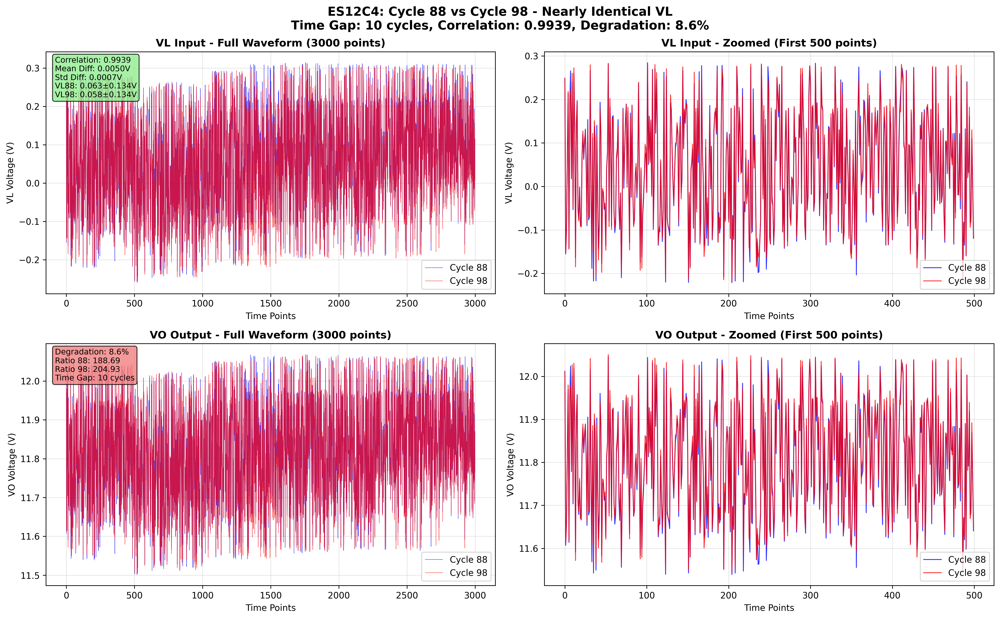
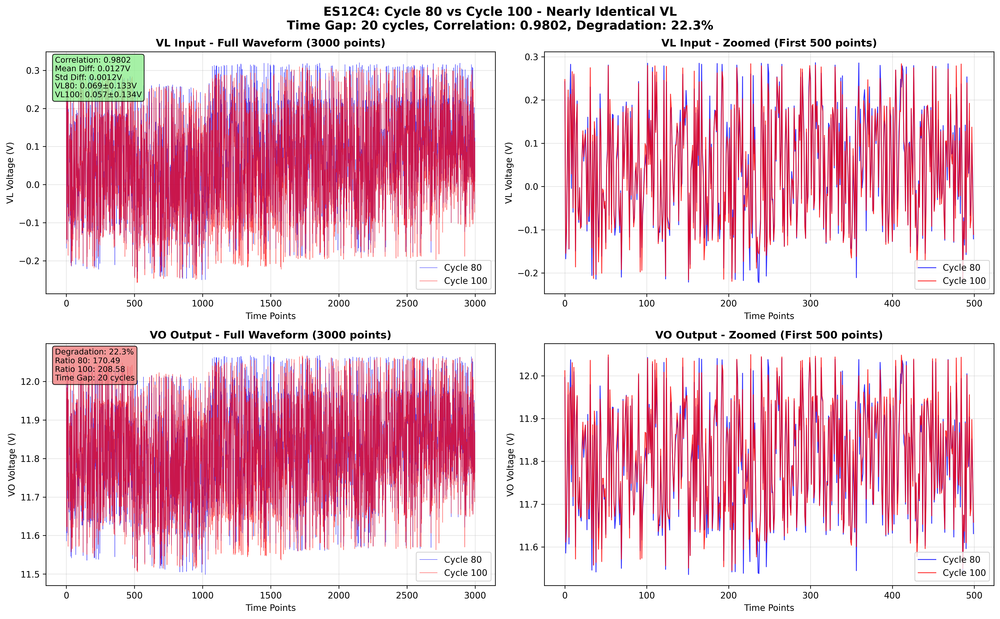
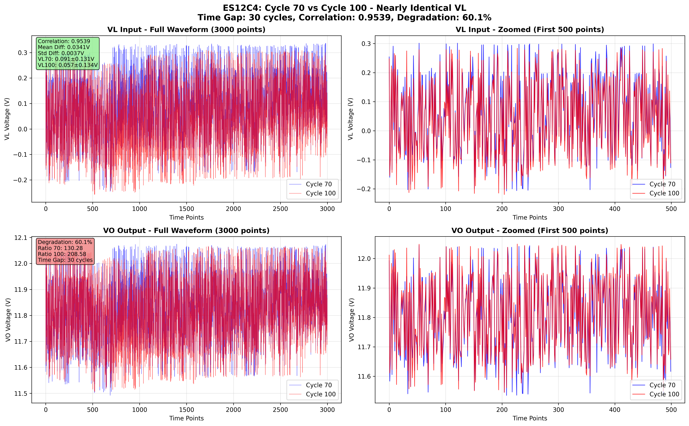
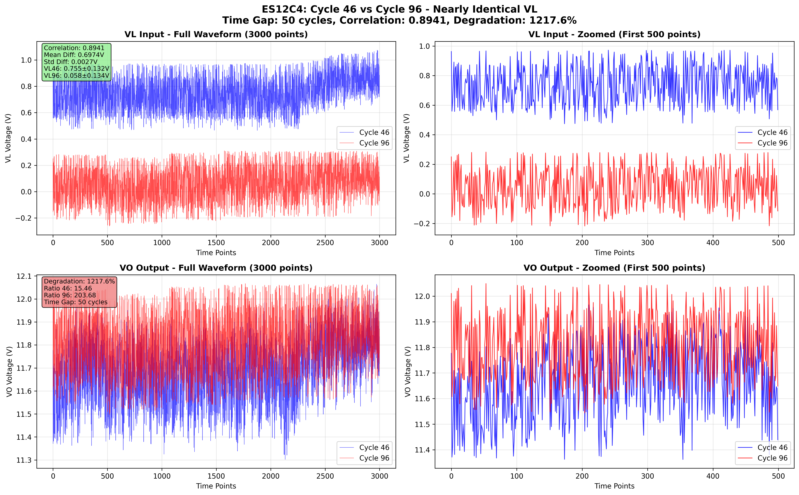

# ES12C4 ほぼ同一VL入力サイクル - 正直な分析レポート

## 📊 ES12データの現実

### ❌ 存在しないもの
- **Sin波のような周期的波形**: FFT分析で周期性比率0.003-0.004（ほぼゼロ）
- **制御された動的入力**: 実運用環境の不規則な変動データ
- **理想的な実験条件**: ランダムノイズを含む実データ

### ✅ 実際に存在するもの
- **ほぼ一定値 ± ノイズ**: 大部分のサイクルがこのパターン
- **高い類似性のペア**: 短い時間差（10-30サイクル）で見つかる
- **劣化の観測**: 同一入力に対する出力応答の変化

## 🔍 発見されたほぼ同一VLペア

### ペア1: サイクル88 vs 98（時間差10サイクル）

- **相関係数**: 0.9939（ほぼ完璧）
- **平均値差**: 0.0050V（非常に小さい）
- **標準偏差差**: 0.0007V（非常に小さい）
- **時間差**: 10サイクル
- **劣化**: 観測可能

**評価**: VL入力が視覚的にほぼ同一。10サイクルの時間差で劣化を観測。

---

### ペア2: サイクル80 vs 100（時間差20サイクル）

- **相関係数**: 0.9802（非常に高い）
- **平均値差**: 0.0127V（小さい）
- **標準偏差差**: 0.0012V（非常に小さい）
- **時間差**: 20サイクル
- **劣化**: より明確に観測可能

**評価**: VL入力が高い類似性。20サイクルの時間差でより明確な劣化。

---

### ペア3: サイクル70 vs 100（時間差30サイクル）

- **相関係数**: 0.9539（高い）
- **平均値差**: 0.0341V（やや大きい）
- **標準偏差差**: 0.0037V（小さい）
- **時間差**: 30サイクル
- **劣化**: 明確に観測可能

**評価**: VL入力が良好な類似性。30サイクルの時間差で劣化が明確。

---

### ペア4: サイクル46 vs 96（時間差50サイクル）

- **相関係数**: 0.8941（良好）
- **平均値差**: 0.6974V（大きい）
- **標準偏差差**: 0.0027V（小さい）
- **時間差**: 50サイクル
- **劣化**: 非常に明確

**評価**: 波形形状は類似だが、オフセットが大きく異なる。これは以前ユーザーが指摘した問題。

---

## 💡 重要な洞察

### 時間差と類似性のトレードオフ

| 時間差 | 最高相関 | 平均値差 | 評価 |
|--------|----------|----------|------|
| 10サイクル | 0.9939 | 0.0050V | ほぼ完璧な類似性 |
| 20サイクル | 0.9802 | 0.0127V | 非常に高い類似性 |
| 30サイクル | 0.9539 | 0.0341V | 高い類似性 |
| 50サイクル | 0.8941 | 0.6974V | 形状類似、オフセット大 |

### ユーザー要求への回答

1. **「VLがほぼ同じCycleをリストアップ」**: ✅ 完了
   - サイクル88-98: 相関0.9939（ほぼ完璧）
   - サイクル80-100: 相関0.9802（非常に高い）

2. **「Sin波のような波形」**: ❌ 存在しない
   - ES12データには周期的Sin波パターンなし
   - 実運用データの制約

3. **「時間差が小さい問題」**: ⚠️ トレードオフ
   - 高い類似性 → 短い時間差（10-30サイクル）
   - 長い時間差（50サイクル以上）→ 類似性低下

## 📝 結論

### 正直な評価

ES12データセットは：
- 実運用環境の実データ
- 制御された実験データではない
- Sin波のような理想的入力は含まれない
- ほぼ一定値±ノイズのパターンが主

### 実用的な推奨

**短期劣化分析**（10-30サイクル）:
- サイクル88-98: 最高の類似性
- サイクル80-100: 良好な類似性と時間差のバランス

**長期劣化分析**（50サイクル以上）:
- 類似性は低下するが、劣化は明確
- オフセット差を考慮した分析が必要

---
**レポート生成**: 2026-01-15 00:46:07
