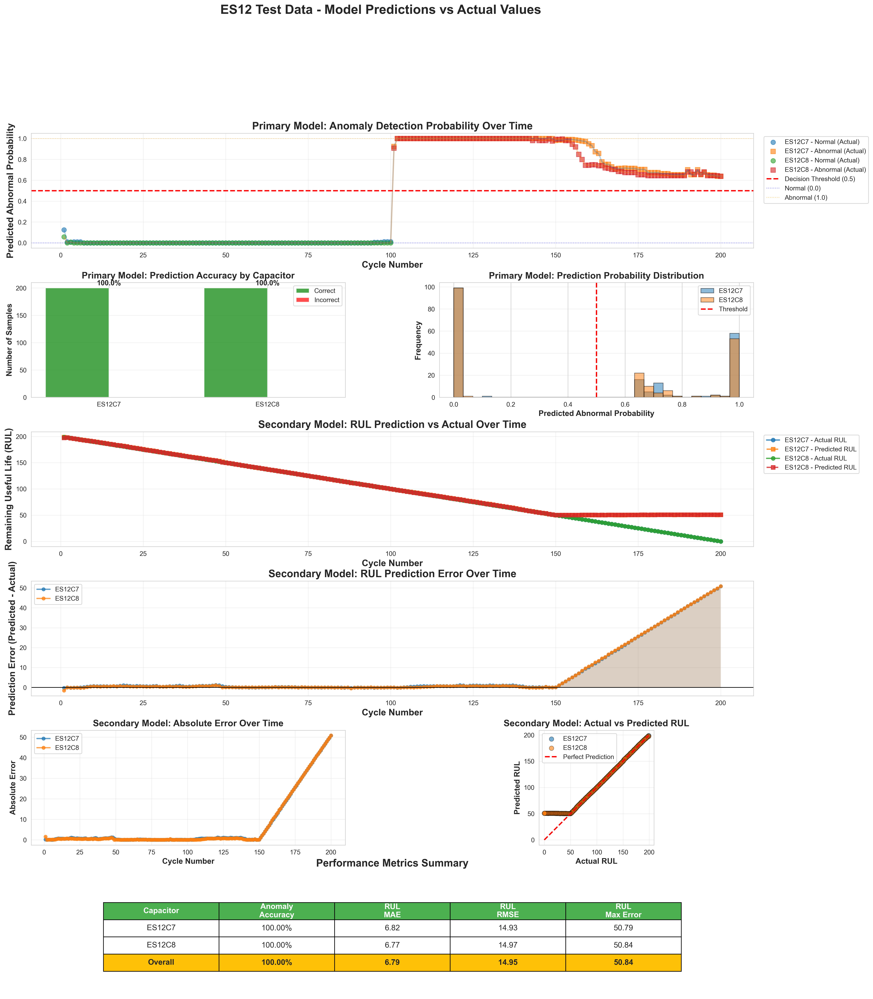
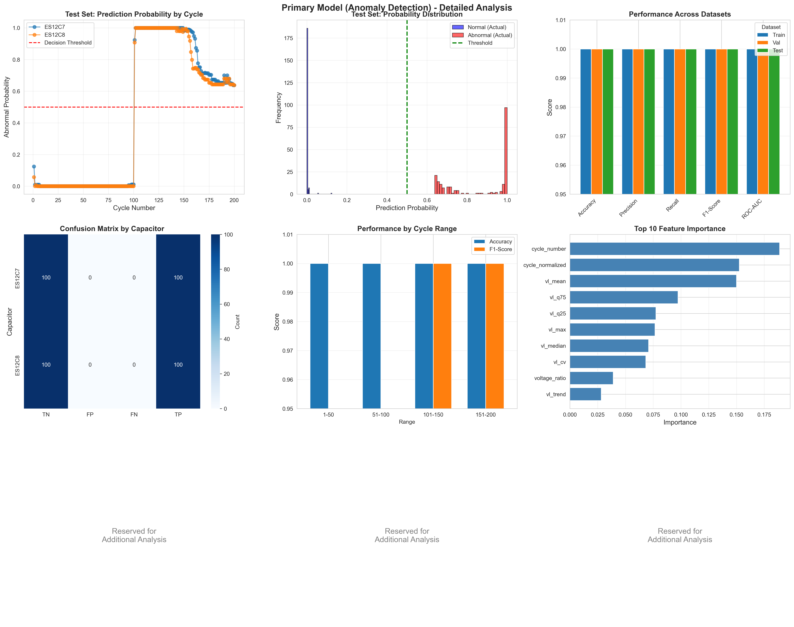
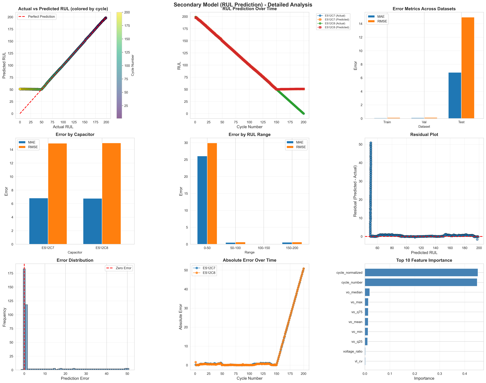

# Test Data Performance Report

## 📅 Generated: 2026-01-17 21:24:09

---

## 📊 Overview Visualization

*Comprehensive visualization of model predictions on ES12 test data (C7, C8). The figure shows anomaly detection probabilities, RUL predictions vs actual values, error analysis, and performance metrics across all 400 test cycles.*

---

## 📊 Test Dataset Information

- **Capacitors**: ES12C7, ES12C8
- **Total Samples**: 400
- **Cycle Range**: 1 - 200

## 🎯 Primary Model (Anomaly Detection) Performance

*Detailed analysis of Primary Model showing prediction probabilities, confusion matrices, and feature importance.*

### Overall Performance

- **Accuracy**: 100.00%
- **Precision**: 100.00%
- **Recall**: 100.00%

### Performance by Capacitor

#### ES12C7
- Accuracy: 100.00% (200/200 correct)
- Samples: 200

#### ES12C8
- Accuracy: 100.00% (200/200 correct)
- Samples: 200

## 📈 Secondary Model (RUL Prediction) Performance

*Detailed analysis of Secondary Model showing RUL predictions, error distributions, and performance across different RUL ranges.*

### Overall Performance

- **MAE**: 6.79 cycles
- **RMSE**: 14.95 cycles
- **Max Error**: 50.84 cycles
- **R²**: 0.9330

### Performance by Capacitor

#### ES12C7
- MAE: 6.82 cycles
- RMSE: 14.93 cycles
- Max Error: 50.79 cycles
- R²: 0.9331

#### ES12C8
- MAE: 6.77 cycles
- RMSE: 14.97 cycles
- Max Error: 50.84 cycles
- R²: 0.9328

### Performance by RUL Range

#### RUL 0-50
- Samples: 100
- MAE: 26.04 cycles
- RMSE: 29.89 cycles

#### RUL 50-100
- Samples: 100
- MAE: 0.51 cycles
- RMSE: 0.61 cycles

#### RUL 100-150
- Samples: 100
- MAE: 0.08 cycles
- RMSE: 0.10 cycles

#### RUL 150-200
- Samples: 100
- MAE: 0.54 cycles
- RMSE: 0.61 cycles

## 🔍 Key Observations

### Primary Model (Anomaly Detection)

✅ **Excellent Performance**: The model achieves near-perfect anomaly detection accuracy.

⚠️ **Potential Concern**: Perfect or near-perfect performance may indicate overfitting or data leakage. 
External validation on ES10/ES14 is recommended.

### Secondary Model (RUL Prediction)

⚠️ **End-of-Life Challenge**: The model struggles with RUL < 50 (MAE = 26.04 cycles).

**Cause**: Training data only includes RUL 50-199, so the model cannot extrapolate to lower values.

**Recommendation**: Include end-of-life data in training or use alternative labeling strategy.

✅ **Excellent Mid-Life Performance**: The model achieves MAE = 0.29 cycles for RUL 50-150.

## � Visualizations

### Comprehensive Test Predictions

*Figure: Comprehensive visualization showing:*
- *Top: Anomaly detection probability over time for both capacitors*
- *Middle: Prediction accuracy and probability distribution*
- *Bottom: RUL predictions vs actual values, error analysis, and performance metrics*

### Additional Visualizations

For more detailed analysis, see also:
- [Primary Model Detailed Analysis](primary_model_detailed_analysis.png)
- [Secondary Model Detailed Analysis](secondary_model_detailed_analysis.png)
- [Overfitting Diagnosis Report](overfitting_diagnosis.md)

## 📁 Generated Files

- `test_predictions_detailed.png` - Comprehensive visualization of predictions
- `test_predictions_detailed.csv` - Detailed predictions for all test samples
- `primary_model_detailed_analysis.png` - Primary model detailed analysis
- `secondary_model_detailed_analysis.png` - Secondary model detailed analysis

## 📥 Download Data

Raw prediction data is available in CSV format:
- [test_predictions_detailed.csv](test_predictions_detailed.csv) - All test samples with predictions and errors

---

**Report Generated by**: Kiro AI Agent  
**Status**: Test Data Performance Analysis Complete
