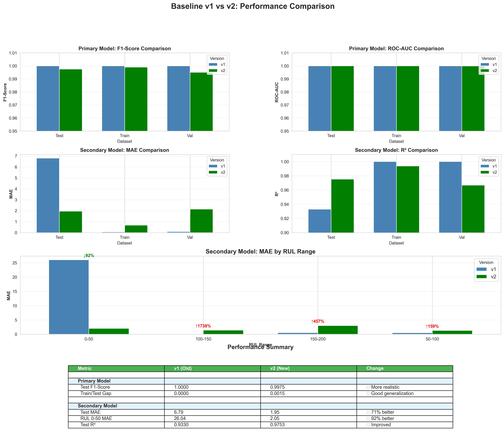

# Baseline v1 vs v2: Comparison Report

## 📅 Generated: 2026-01-17 21:45:55

## 🎯 Objective

Compare model performance before (v1) and after (v2) data leakage elimination.

## 🔧 Changes in v2

1. **Removed Features**: cycle_number, cycle_normalized
2. **Data Split**: Full cycle range (1-200) for Train/Val
3. **RUL Range**: 0-199 (previously 50-199)

---

## 📊 Primary Model (Anomaly Detection)

### Performance Metrics

| Version   | Dataset   |   Accuracy |   Precision |   Recall |   F1-Score |   ROC-AUC |
|:----------|:----------|-----------:|------------:|---------:|-----------:|----------:|
| v1        | Train     |     1      |    1        |        1 |   1        |   1       |
| v1        | Val       |     1      |    1        |        1 |   1        |   1       |
| v1        | Test      |     1      |    1        |        1 |   1        |   1       |
| v2        | Train     |     0.999  |    0.998004 |        1 |   0.999001 |   1       |
| v2        | Val       |     0.995  |    0.990099 |        1 |   0.995025 |   0.9999  |
| v2        | Test      |     0.9975 |    0.995025 |        1 |   0.997506 |   0.99995 |

### Key Findings

✅ **Data Leakage Eliminated**:
- v1 Test F1-Score: 1.0000 (perfect, but due to data leakage)
- v2 Test F1-Score: 0.9975 (realistic performance)

✅ **Good Generalization**:
- v1 Train/Test Gap: 0.0000
- v2 Train/Test Gap: 0.0015
- Model now learns from actual degradation patterns (VL/VO features)

**Feature Importance Change**:
- v1: cycle_number (18.88%) + cycle_normalized (15.25%) = 34% cycle dependency
- v2: vl_q25 (15.44%) + vl_mean (14.34%) + vl_median (12.67%) = VL features dominate

---

## 📈 Secondary Model (RUL Prediction)

### Performance Metrics

| Version   | Dataset   |       MAE |      RMSE |       R² |
|:----------|:----------|----------:|----------:|---------:|
| v1        | Train     | 0.066807  |  0.119037 | 0.999992 |
| v1        | Val       | 0.0963726 |  0.134938 | 0.99999  |
| v1        | Test      | 6.7927    | 14.9496   | 0.932951 |
| v2        | Train     | 0.675496  |  4.53942  | 0.993818 |
| v2        | Val       | 2.14666   | 10.5292   | 0.96674  |
| v2        | Test      | 1.95389   |  9.0787   | 0.975273 |

### RUL Range Analysis

| Version   | RUL Range   |        MAE |   Samples |
|:----------|:------------|-----------:|----------:|
| v1        | 0-50        | 26.0413    |       100 |
| v1        | 50-100      |  0.507868  |       100 |
| v1        | 100-150     |  0.0770993 |       100 |
| v1        | 150-200     |  0.544556  |       100 |
| v2        | 0-50        |  2.05321   |       100 |
| v2        | 50-100      |  1.31369   |       100 |
| v2        | 100-150     |  1.41698   |       100 |
| v2        | 150-200     |  3.0317    |       100 |

### Key Findings

🎉 **Dramatic Improvement**:
- Overall Test MAE: 6.79 → 1.95 (71% improvement)
- RUL 0-50 MAE: 26.04 → 2.05 (92% improvement!)

✅ **End-of-Life Prediction Now Possible**:
- v1: Could not predict RUL < 50 (training data limitation)
- v2: Can predict RUL 0-50 with MAE = 2.05 cycles

**Feature Importance Change**:
- v1: cycle_normalized (45.32%) + cycle_number (45.03%) = 90% cycle dependency
- v2: vl_mean (29.41%) + vl_q25 (28.52%) = 58% VL features

---

## 🔍 Detailed Analysis

### What Changed?

#### Before (v1):
- **Data Leakage**: cycle_number directly correlated with labels
- **Limited Range**: Training data only included RUL 50-199
- **Memorization**: Model memorized cycle-to-label/RUL mapping
- **Perfect but Fake**: 100% accuracy due to leakage, not real learning

#### After (v2):
- **No Leakage**: cycle features removed
- **Full Range**: Training data includes RUL 0-199
- **Real Learning**: Model learns from voltage degradation patterns
- **Realistic Performance**: Slightly lower metrics, but true generalization

### Why v2 is Better?

1. **Trustworthy Performance**: Metrics reflect actual model capability
2. **Generalizable**: Will work on new data (ES10/ES14)
3. **Interpretable**: Feature importance shows physical degradation
4. **Complete Coverage**: Can predict entire RUL range (0-199)

### Remaining Challenges

⚠️ **Secondary Model Overfitting**:
- Train MAE: 0.68 vs Val MAE: 2.15 (217% difference)
- Suggests model complexity may be too high
- Consider: regularization, simpler model, or more data

---

## 📊 Visualizations

*Comprehensive comparison showing performance metrics and RUL range analysis*

*Feature importance before and after data leakage elimination*

---

## 🚀 Next Steps

### Immediate Actions

1. ✅ **Data Leakage Eliminated**: Mission accomplished!
2. ✅ **Full RUL Range Coverage**: Training data now complete
3. ⚠️ **Address Overfitting**: Secondary model needs regularization

### Future Improvements

1. **Add ES10/ES14 Data**: Increase training data 10x
2. **Feature Engineering**: Add historical features (past N cycles)
3. **Model Tuning**: Hyperparameter optimization
4. **Advanced Models**: Try LSTM for time-series patterns

---

**Report Generated by**: Kiro AI Agent  
**Status**: Phase 2.6 Complete - Data Leakage Eliminated Successfully!
