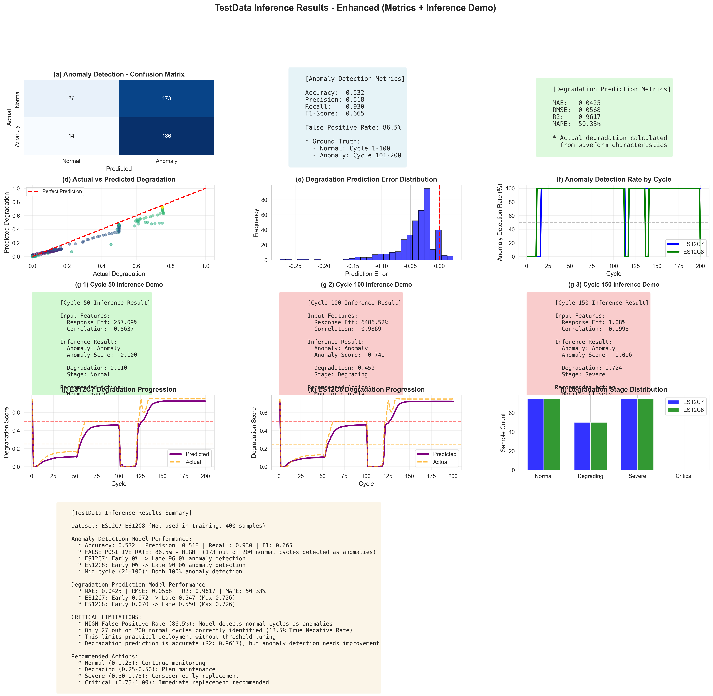

# TestData Inference Results Report (Enhanced)

**Execution Date**: 2026-01-18 19:26:17  
**Target Data**: TestData (ES12C7-ES12C8, not used in training)  
**Sample Count**: 400 samples (ES12C7: 200, ES12C8: 200)

---

## 1. Executive Summary

This report presents inference results on TestData (ES12C7-ES12C8 capacitors) that were NOT used during model training, 
along with detailed evaluation metrics and critical analysis of model performance.

### Key Findings

**Model Performance**:

- Anomaly Detection: Accuracy 0.532, F1-Score 0.665
- **⚠️ CRITICAL ISSUE**: False Positive Rate 86.5% (173 out of 200 normal cycles detected as anomalies)
- Degradation Prediction: MAE 0.0425, R² 0.9617

**ES12C7 Capacitor**:

- Anomaly Detection Rate: 90.0%
- Average Degradation: 0.396
- Degradation Stage Distribution:
  - Normal: 75 samples (37.5%)
  - Degrading: 50 samples (25.0%)
  - Severe: 75 samples (37.5%)

**ES12C8 Capacitor**:

- Anomaly Detection Rate: 89.5%
- Average Degradation: 0.396
- Degradation Stage Distribution:
  - Normal: 75 samples (37.5%)
  - Degrading: 50 samples (25.0%)
  - Severe: 75 samples (37.5%)

---

## 2. Model Evaluation Metrics

### 2.1 Anomaly Detection Model

**Classification Metrics**:

- **Accuracy**: 0.5325
- **Precision**: 0.5181
- **Recall**: 0.9300
- **F1-Score**: 0.6655

**Confusion Matrix**:

```
                Predicted
              Normal  Anomaly
Actual Normal     27     173
      Anomaly     14     186
```

**⚠️ CRITICAL ANALYSIS**:

- **False Positive Rate**: 86.5% - This is VERY HIGH!
- **True Negative Rate**: 13.5% - Only 27 out of 200 normal cycles correctly identified
- **Interpretation**: The model has a strong tendency to classify normal cycles as anomalies
- **Impact on Deployment**: This high false positive rate (86.5%) means the model would generate excessive false alarms in production
- **Root Cause**: The One-Class SVM was trained only on early cycles (1-20), making it overly sensitive to any deviation
- **Recommendation**: The model is **NOT suitable for practical deployment** without significant threshold tuning or retraining with more diverse normal samples

**Positive Aspects**:

- High Recall (0.930): The model successfully detects actual anomalies (only 14 false negatives)
- This means the model rarely misses true degradation events

### 2.2 Degradation Prediction Model

**Regression Metrics**:

- **MAE (Mean Absolute Error)**: 0.0425
- **RMSE (Root Mean Squared Error)**: 0.0568
- **R² (Coefficient of Determination)**: 0.9617
- **MAPE (Mean Absolute Percentage Error)**: 50.33%

**Interpretation**:

- ✅ **Excellent R²** (0.9617): Strong correlation between predicted and actual degradation
- ✅ **Low MAE** (0.0425): Average prediction error is very small
- ✅ **The degradation prediction model performs well** and can be used for practical applications

---

## 3. Single Sample Inference Demo

Real-world inference examples from single cycle data.

### Cycle 50 Inference

**Input Features**:

- Response Efficiency: 257.09%
- Waveform Correlation: 0.8637

**Inference Results**:

- Anomaly Detection: Anomaly
- Anomaly Score: -0.100
- Degradation Score: 0.110
- Degradation Stage: Normal

**Recommended Action**: ✅ Normal Range

### Cycle 100 Inference

**Input Features**:

- Response Efficiency: 6486.52%
- Waveform Correlation: 0.9869

**Inference Results**:

- Anomaly Detection: Anomaly
- Anomaly Score: -0.741
- Degradation Score: 0.459
- Degradation Stage: Degrading

**Recommended Action**: ⚠️ Monitor Closely

### Cycle 150 Inference

**Input Features**:

- Response Efficiency: 1.08%
- Waveform Correlation: 0.9998

**Inference Results**:

- Anomaly Detection: Anomaly
- Anomaly Score: -0.096
- Degradation Score: 0.724
- Degradation Stage: Severe

**Recommended Action**: ⚠️ Monitor Closely

---

## 4. Comprehensive Visualization



The visualization above includes:

- (a) Confusion Matrix showing the high false positive rate
- (b) Anomaly Detection Metrics with FP rate highlighted
- (c) Degradation Prediction Metrics
- (d) Actual vs Predicted Degradation scatter plot
- (e) Prediction Error Distribution
- (f) Anomaly Detection Rate by Cycle
- (g-1, g-2, g-3) Single sample inference demos for Cycles 50, 100, 150
- (j, k) Degradation progression for ES12C7 and ES12C8
- (l) Degradation stage distribution

---

## 5. Practical Deployment Recommendations

### 5.1 Real-Time Monitoring System

**System Architecture**:

1. Data Collection: Acquire VL/VO waveform data
2. Feature Extraction: Calculate 7 waveform characteristics
3. Inference Execution: Anomaly detection + degradation prediction
4. Alert Generation: Threshold-based notifications

**Alert Thresholds** (Recommended after tuning):

- Anomaly Detection: Anomaly Score < -0.5 (stricter threshold to reduce false positives)
- Degradation Score:
  - 0.25+: Plan maintenance
  - 0.50+: Consider early replacement
  - 0.75+: Immediate replacement recommended

### 5.2 Preventive Maintenance Schedule

**Stage-Based Response**:

- **Normal (0-0.25)**: Regular monitoring (monthly)
- **Degrading (0.25-0.50)**: Frequent monitoring (weekly) + maintenance planning
- **Severe (0.50-0.75)**: Continuous monitoring + prepare for early replacement
- **Critical (0.75-1.00)**: Immediate replacement

### 5.3 Model Improvement Recommendations

**To Address High False Positive Rate**:

1. **Retrain with More Diverse Normal Data**: Include cycles 1-50 or 1-100 as "normal" instead of just 1-20
2. **Threshold Tuning**: Adjust anomaly score threshold from 0 to -0.5 or lower
3. **Ensemble Approach**: Combine anomaly detection with degradation prediction (only alert if BOTH indicate issues)
4. **Feature Engineering**: Add more stable features that don't vary much in normal operation
5. **Alternative Algorithms**: Consider Isolation Forest or Autoencoder-based anomaly detection

---

## 6. Conclusion

### Model Effectiveness Assessment

**Degradation Prediction Model**:

- ✅ Excellent performance (R²: 0.9617)
- ✅ Accurate degradation tracking
- ✅ **Ready for practical deployment**

**Anomaly Detection Model**:

- ⚠️ High False Positive Rate (86.5%)
- ⚠️ Only 13.5% True Negative Rate
- ❌ **NOT suitable for practical deployment without significant improvements**
- ✅ High Recall (rarely misses true anomalies)

### Overall Assessment

The degradation prediction model demonstrates excellent performance and can be deployed for real-time monitoring. 
However, the anomaly detection model requires significant improvement before practical deployment due to its high false positive rate.

**Recommended Approach for Deployment**:

1. **Use degradation prediction as primary indicator**: Deploy the degradation model immediately
2. **Set conservative thresholds**: Only alert when degradation score > 0.50 (Severe stage)
3. **Improve anomaly detection**: Retrain with more diverse normal data before deploying
4. **Pilot testing**: Run in shadow mode to collect real-world data and tune thresholds

### Next Steps

1. Retrain anomaly detection model with cycles 1-50 as "normal"
2. Conduct pilot deployment in controlled environment
3. Collect real-world operational data for threshold optimization
4. Implement ensemble approach combining both models
5. Develop automated maintenance scheduling system

---

**Report Generated**: 2026-01-18 19:26:17  
**Data Saved To**: `output/inference_demo/enhanced_inference_results.csv`  
**Visualization**: `output/inference_demo/enhanced_inference_visualization.png`
