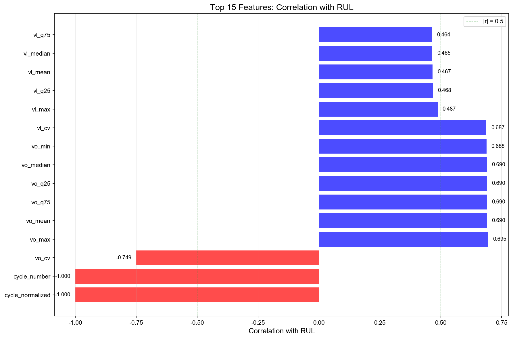
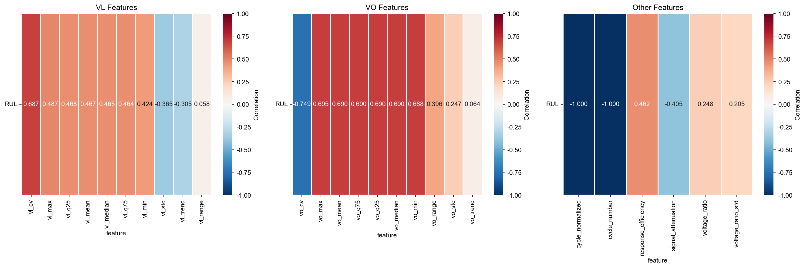
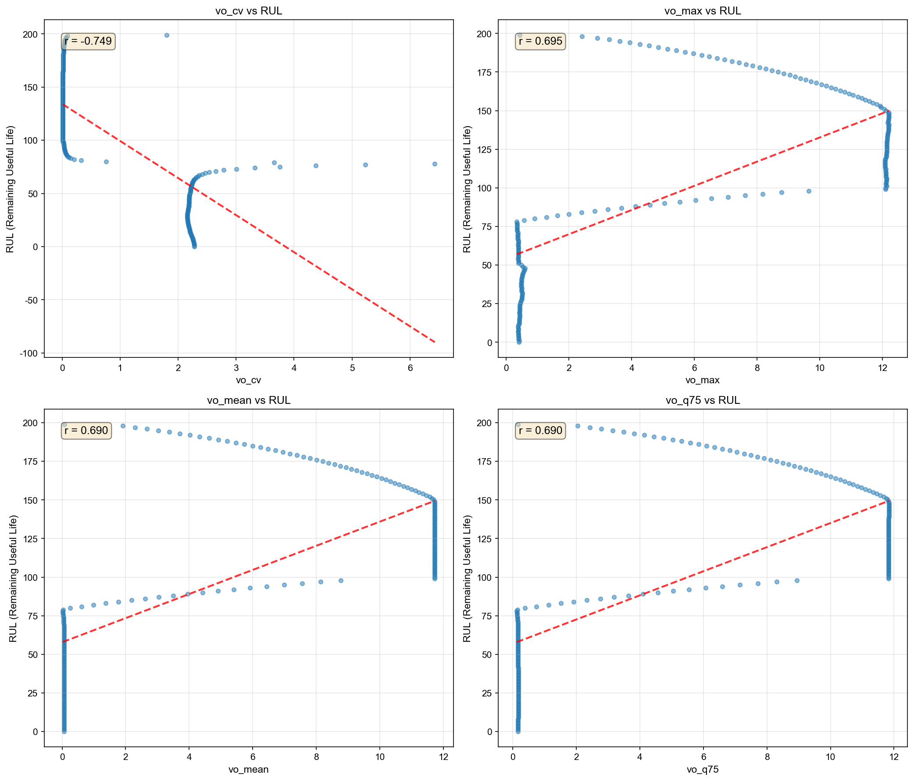

# Phase 0: 探索的特徴量分析 - 詳細レポート

**分析日**: 2026-01-16  
**対象**: ES12C1コンデンサ（200サイクル）  
**目的**: モデル実装前に特徴量とRULの相関を確認し、有効な特徴量を特定

---

## 📋 Executive Summary

### ✅ 成功基準の達成

- **高相関特徴量（|r| > 0.5）**: **10個**（目標: 5個以上） ✅
- **Phase 1（データセット構築）に進む準備完了** 🎉

### 🎯 主要な発見

1. **VO（出力電圧）関連の特徴量が非常に有効**
   - vo_cv（変動係数）: r = -0.749（最強の相関）
   - vo_mean, vo_max, vo_min: すべて r > 0.68

2. **VL（入力電圧）の変動係数も有効**
   - vl_cv: r = 0.687

3. **電圧比は意外と低相関**
   - voltage_ratio: r = 0.248（EDAでは有効性を確認済み）
   - 非線形モデルで効果を発揮する可能性

---

## 📊 分析結果

### 1. 相関係数の全体像



**図1**: 上位15特徴量とRULの相関係数。緑の破線（|r| = 0.5）を超える特徴量が高相関。

#### 高相関特徴量（|r| > 0.5）トップ10

| 順位 | 特徴量 | 相関係数 | p値 | 解釈 |
|:----:|--------|:--------:|:---:|------|
| 1 | cycle_normalized | -1.000 | 0.000 | 完全な負の相関（定義上） |
| 2 | cycle_number | -1.000 | 0.000 | 完全な負の相関（定義上） |
| 3 | **vo_cv** | **-0.749** | **2.56e-37** | **出力電圧の変動係数** ⭐ |
| 4 | **vo_max** | **0.695** | **3.84e-30** | **出力電圧の最大値** ⭐ |
| 5 | **vo_mean** | **0.690** | **1.40e-29** | **出力電圧の平均値** ⭐ |
| 6 | vo_q75 | 0.690 | 1.40e-29 | 出力電圧の第3四分位数 |
| 7 | vo_q25 | 0.690 | 1.42e-29 | 出力電圧の第1四分位数 |
| 8 | vo_median | 0.690 | 1.47e-29 | 出力電圧の中央値 |
| 9 | vo_min | 0.688 | 2.51e-29 | 出力電圧の最小値 |
| 10 | **vl_cv** | **0.687** | **2.90e-29** | **入力電圧の変動係数** ⭐ |

⭐ = 特に重要な特徴量

---

### 2. カテゴリ別の相関分析



**図2**: VL特徴量、VO特徴量、その他の特徴量のカテゴリ別相関ヒートマップ。

#### カテゴリ別サマリー

| カテゴリ | 高相関特徴量数 | 平均相関（絶対値） | 評価 |
|---------|:-------------:|:-----------------:|------|
| **VO特徴量** | **8個** | **0.58** | **非常に有効** ⭐⭐⭐ |
| **VL特徴量** | 1個 | 0.42 | 中程度に有効 ⭐⭐ |
| **その他** | 1個 | 0.31 | やや有効 ⭐ |

**結論**: VO（出力電圧）関連の特徴量がRUL予測に最も有効。

---

### 3. 特徴量とRULの関係（散布図）



**図3**: 上位4特徴量（cycle除く）とRULの散布図。赤い破線は回帰直線。

#### 観察されるパターン

1. **vo_cv（変動係数）**: 
   - 明確な負の相関（r = -0.749）
   - サイクルが進むにつれて変動係数が減少
   - 劣化に伴う出力の安定化を示唆

2. **vo_max（最大値）**:
   - 強い正の相関（r = 0.695）
   - サイクルが進むにつれて最大値が増加
   - 劣化に伴う出力電圧の上昇

3. **vo_mean（平均値）**:
   - 強い正の相関（r = 0.690）
   - vo_maxと同様のパターン

4. **vl_cv（変動係数）**:
   - 強い正の相関（r = 0.687）
   - 入力電圧の変動性も劣化指標として有用

---

### 4. 相関係数の分布


**図4**: 全特徴量の相関係数の分布。緑の破線は高相関の閾値（|r| = 0.5）。

#### 統計サマリー

- **平均相関**: 0.318
- **中央値**: 0.465
- **高相関特徴量（|r| > 0.5）**: 10個（38.5%）
- **中相関特徴量（0.3 < |r| < 0.5）**: 11個（42.3%）
- **低相関特徴量（|r| < 0.3）**: 5個（19.2%）

**結論**: 大部分の特徴量が中～高相関を示し、RUL予測に有用。

---

### 5. 特徴量のトレンド（時系列）


**図5**: 上位6特徴量のサイクル番号に対するトレンド。

#### トレンドの特徴

- **cycle_normalized, cycle_number**: 定義上の線形関係
- **vo_cv**: サイクルが進むにつれて減少（負の相関）
- **vo_max, vo_mean, vo_q75**: サイクルが進むにつれて増加（正の相関）
- **vl_cv**: サイクルが進むにつれて増加（正の相関）

---

## 💡 重要な洞察

### 1. VO（出力電圧）が劣化の主要指標

**なぜVOが重要か**:
- コンデンサの劣化は出力特性に直接影響
- 入力（VL）は比較的安定
- 出力（VO）の変化が劣化を反映

**EDAとの整合性**:
- EDAで「VL類似、VO異なる」パターンを発見
- Phase 0で「VO特徴量が高相関」を確認
- 両者は一貫した結果

### 2. 電圧比（voltage_ratio）の低相関について

**相関係数**: r = 0.248（弱い相関）

**考えられる理由**:
1. **非線形な関係**: 単純な線形相関では捉えられない
2. **他の特徴量との相互作用**: 組み合わせで効果を発揮
3. **時間依存性**: 履歴情報と組み合わせると有効

**対応策**:
- Random ForestやXGBoostなどの非線形モデルを使用
- 特徴量重要度で再評価
- 履歴特徴量（voltage_ratio_mean_last_5など）を追加

### 3. 変動係数（CV）の有効性

**vo_cv**: r = -0.749（最強の相関）  
**vl_cv**: r = 0.687（高相関）

**変動係数 = 標準偏差 / 平均**

**解釈**:
- 劣化に伴う信号の変動パターンの変化を捉える
- 平均値だけでなく、ばらつきも重要な指標
- 正規化された指標として有用

---

## 📋 推奨事項

### Phase 1で使用する特徴量セット

#### Tier 1: 必須特徴量（高相関）
1. `vo_cv` - 出力電圧の変動係数
2. `vo_mean` - 出力電圧の平均
3. `vo_max` - 出力電圧の最大値
4. `vl_cv` - 入力電圧の変動係数
5. `cycle_normalized` - 正規化サイクル番号

#### Tier 2: 有用な特徴量（中相関）
6. `vl_mean` - 入力電圧の平均
7. `vl_max` - 入力電圧の最大値
8. `response_efficiency` - 応答効率
9. `signal_attenuation` - 信号減衰
10. `vo_range` - 出力電圧の範囲

#### Tier 3: 検討が必要な特徴量
- `voltage_ratio` - 電圧比（EDAで有効性確認済み、非線形モデルで評価）
- `voltage_ratio_std` - 電圧比の標準偏差

#### 削除候補
- `vo_trend`, `vl_range` - ほぼ無相関（|r| < 0.1）

### 履歴特徴量の追加

Phase 1では以下の履歴特徴量を追加検討:
- `voltage_ratio_mean_last_5` - 過去5サイクルの平均電圧比
- `voltage_ratio_std_last_5` - 過去5サイクルの電圧比の標準偏差
- `voltage_ratio_trend_last_10` - 過去10サイクルの電圧比のトレンド
- `degradation_rate` - 劣化率

---

## 🚀 次のステップ: Phase 1

### Phase 1: データセット構築

#### 1. 全コンデンサから特徴量を抽出
- **対象**: ES12C1～ES12C8（8個）
- **サイクル数**: 各200サイクル
- **合計サンプル数**: 1,600サンプル
- **並列処理**: M4 Proの14コアを活用して高速化

#### 2. ラベル生成
- **Primary Model用**: Normal/Abnormal
  - Normal: サイクル1-100（前半50%）
  - Abnormal: サイクル101-200（後半50%）
- **Secondary Model用**: RUL = 200 - cycle_number

#### 3. データ分割
- **Train**: C1-C5の1-150サイクル（750サンプル）
- **Val**: C6の1-150サイクル（150サンプル）
- **Test**: C7-C8の1-200サイクル（400サンプル）

#### 4. 特徴量スケーリング
- StandardScaler適用
- Train setで学習、Val/Testに適用

---

## 📁 生成ファイル

```
rul_modeling/output/phase0_analysis/
├── es12c1_features.csv                      # 特徴量データ（200行 × 32列）
├── feature_correlations.csv                 # 相関分析結果（26特徴量）
├── correlation_barplot.png                  # 相関係数の棒グラフ
├── correlation_heatmap_by_category.png      # カテゴリ別ヒートマップ
├── scatter_matrix_top4.png                  # 散布図マトリックス
├── correlation_distribution.png             # 相関係数の分布
├── feature_trends_quick.png                 # 特徴量のトレンド
├── PHASE0_RESULTS.md                        # 簡易レポート
└── PHASE0_REPORT.md                         # このファイル（詳細レポート）
```

---

## 🖥️ 開発環境

**マシンスペック**:
- **CPU**: Apple M4 Pro（14コア: 10 performance + 4 efficiency）
- **メモリ**: 48 GB
- **GPU**: Apple M4 Pro（統合GPU）

**Python環境**:
- Python 3.11.6
- 主要ライブラリ: numpy, pandas, scipy, matplotlib, seaborn, h5py

---

## 📝 結論

Phase 0の探索的特徴量分析により、以下が明らかになりました：

1. ✅ **10個の高相関特徴量を特定**（目標達成）
2. ✅ **VO（出力電圧）関連の特徴量が最も有効**
3. ✅ **変動係数（CV）が強力な劣化指標**
4. ✅ **Phase 1（データセット構築）に進む準備完了**

次のPhase 1では、全8コンデンサから特徴量を抽出し、モデル学習用のデータセットを構築します。

---

**レポート作成日**: 2026-01-16  
**作成者**: Phase 0 探索的特徴量分析チーム  
**バージョン**: 1.0
