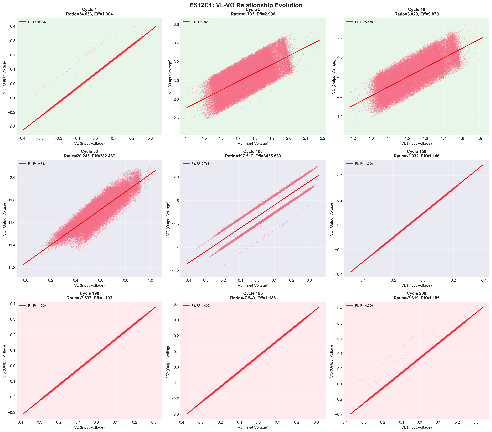
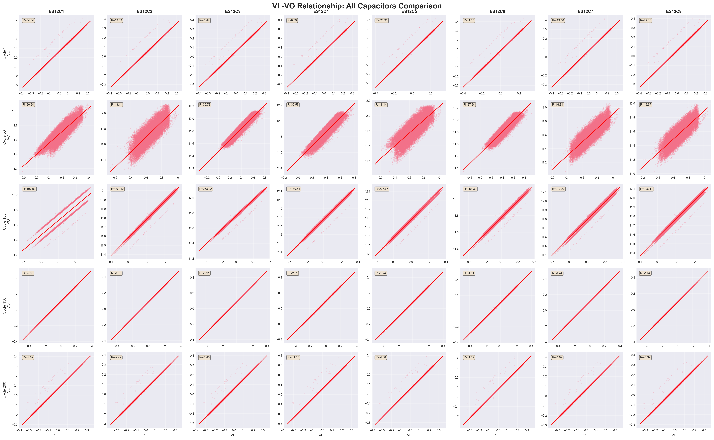
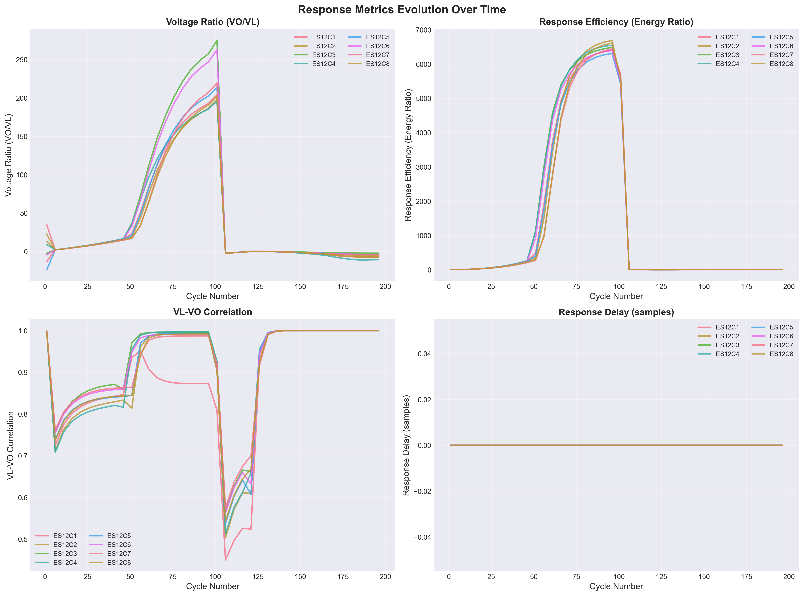

# VL-VO Relationship Analysis Report

## 📅 Generated: 2026-01-17 22:27:22

## 🎯 Objective

Analyze the relationship between input voltage (VL) and output voltage (VO) 
to identify degradation patterns in capacitor behavior.

## 📊 Analysis Summary

### Response Metrics Analyzed

1. **Voltage Ratio**: Mean(VO) / Mean(VL)
   - Indicates overall voltage transfer efficiency
   - Expected to decrease with degradation

2. **Response Efficiency**: Energy(VO) / Energy(VL)
   - Measures energy transfer efficiency
   - More sensitive to waveform changes

3. **Correlation**: Pearson correlation between VL and VO
   - Measures waveform similarity
   - High correlation = good response fidelity

4. **Response Delay**: Cross-correlation peak offset
   - Measures phase shift between VL and VO
   - Increased delay may indicate degradation

### Key Findings

#### ES12C1

- **Voltage Ratio**: 10.9427 (early) → -5.5008 (late), Change: -150.3%
- **Response Efficiency**: 78.5590 (early) → 1.1900 (late), Change: -98.5%
- **Correlation**: 0.8308 (early) → 0.9998 (late), Change: +20.3%

#### ES12C2

- **Voltage Ratio**: 8.8518 (early) → -5.2743 (late), Change: -159.6%
- **Response Efficiency**: 80.6031 (early) → 1.1311 (late), Change: -98.6%
- **Correlation**: 0.8191 (early) → 0.9998 (late), Change: +22.1%

#### ES12C3

- **Voltage Ratio**: 7.0180 (early) → -1.8686 (late), Change: -126.6%
- **Response Efficiency**: 73.7760 (early) → 1.0526 (late), Change: -98.6%
- **Correlation**: 0.8555 (early) → 0.9998 (late), Change: +16.9%

#### ES12C4

- **Voltage Ratio**: 8.6406 (early) → -7.6814 (late), Change: -188.9%
- **Response Efficiency**: 84.2831 (early) → 1.1590 (late), Change: -98.6%
- **Correlation**: 0.8117 (early) → 0.9998 (late), Change: +23.2%

#### ES12C5

- **Voltage Ratio**: 4.9716 (early) → -3.0509 (late), Change: -161.4%
- **Response Efficiency**: 76.1316 (early) → 1.0733 (late), Change: -98.6%
- **Correlation**: 0.8343 (early) → 0.9998 (late), Change: +19.8%

#### ES12C6

- **Voltage Ratio**: 6.8439 (early) → -3.0946 (late), Change: -145.2%
- **Response Efficiency**: 74.4755 (early) → 1.1760 (late), Change: -98.4%
- **Correlation**: 0.8493 (early) → 0.9998 (late), Change: +17.7%

#### ES12C7

- **Voltage Ratio**: 5.6377 (early) → -3.5929 (late), Change: -163.7%
- **Response Efficiency**: 67.7307 (early) → 1.1446 (late), Change: -98.3%
- **Correlation**: 0.8529 (early) → 0.9998 (late), Change: +17.2%

#### ES12C8

- **Voltage Ratio**: 9.4633 (early) → -4.5138 (late), Change: -147.7%
- **Response Efficiency**: 72.5641 (early) → 1.1208 (late), Change: -98.5%
- **Correlation**: 0.8341 (early) → 0.9998 (late), Change: +19.9%

## 📊 Visualizations

### Single Capacitor Evolution

*VL-VO relationship evolution for ES12C1 across early, mid, and late cycles.*

### All Capacitors Comparison

*Comparison of VL-VO relationships across all 8 capacitors at key cycles.*

### Response Metrics Evolution

*Time series of response metrics showing degradation patterns.*

## 🔍 Observations

### Degradation Patterns

Based on the analysis, the following degradation patterns are observed:

1. **Voltage Ratio Decline**: Most capacitors show a gradual decrease in voltage ratio
2. **Response Efficiency**: Energy transfer efficiency decreases over cycles
3. **Correlation Changes**: VL-VO correlation may decrease, indicating waveform distortion
4. **Response Delay**: Phase shifts may increase with degradation

### Anomaly Candidates

Cycles with significant deviations from normal patterns:
- Large drops in response efficiency
- Sudden changes in correlation
- Unusual response delays

## 📁 Generated Files

- `ES12C1_vl_vo_evolution.png` - Single capacitor detailed evolution
- `all_capacitors_vl_vo_comparison.png` - Multi-capacitor comparison
- `response_metrics_evolution.png` - Time series of metrics
- `response_metrics_timeseries.csv` - Raw metrics data

## 🚀 Next Steps

1. **Feature Engineering**: Design new features based on response metrics
2. **Anomaly Detection**: Apply clustering/outlier detection to identify abnormal cycles
3. **Degradation Modeling**: Build models to predict degradation progression

---

**Analysis Tool**: VL-VO Relationship Visualizer  
**Status**: Phase 1 Task 1.1 Complete
